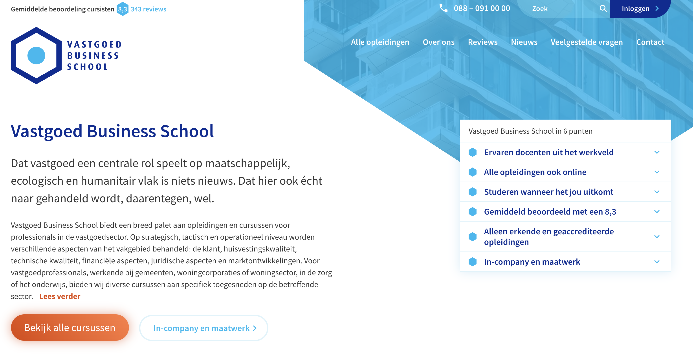

# Vastgoed Business School

Geboren uit een project vanuit mijn stage voor Silverbee (nu [Webcommitment](https://webcommitment.nl/)), is Vastgoed Business School het grootste project geworden waar ik in 2017 aan heb gewerkt. Naast mij werkte ook mijn collega ontwikkelaar en goede vriend, [Bas Borkink](https://www.linkedin.com/in/bas-borkink-790185105/), mee aan dit project.

## Werkwijze
